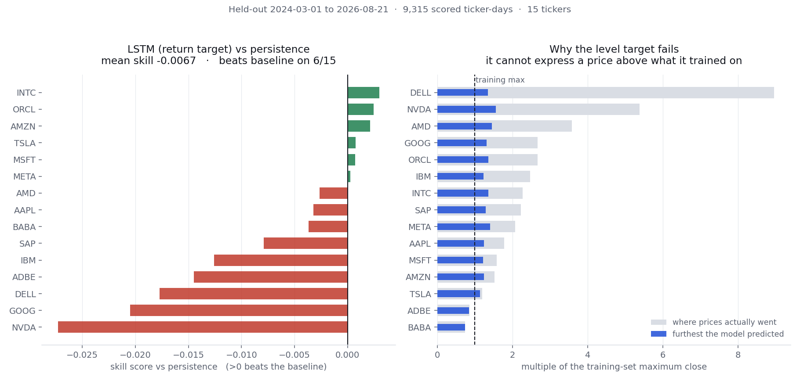

# stock-lstm-vs-persistence

**Does an LSTM beat `tomorrow's close = today's close`?** On 15 large-cap tech tickers, over
two and a half years of held-out data, measured in dollars: **no.**

📊 **[Results page →](https://ssavan99.github.io/stock-lstm-vs-persistence/)**
· 📈 **[Live scoreboard →](https://ssavan99.github.io/stock-lstm-vs-persistence/scoreboard.html)**

Next-day close prediction is a standard first deep-learning-on-finance project, and it is
usually reported without a baseline and in normalised units — a mean absolute error of
`0.0258` on MinMax-scaled closes looks small and means nothing. This repository does the
comparison the task actually calls for: the same model, scored in dollars, against the
trivial forecast that tomorrow's price is today's.



## The result

Held out: **2024-03-01 → 2026-08-21**, 9,315 scored ticker-days, never touched during
fitting, scaling, early stopping or model selection.

| Model | Mean skill vs persistence | Beats persistence | Mean MAPE |
|---|---|---|---|
| Persistence (baseline) | — | — | 1.909% |
| Random walk with drift | −0.0002 | 11 / 15 * | 1.909% |
| AR(5) on returns | −0.0068 | 0 / 15 | 1.923% |
| **Bi-LSTM, return target** | **−0.0067** | **6 / 15** | 1.929% |
| Bi-LSTM, level target | −8.0148 | 0 / 15 | 16.966% |

Skill score is `1 − RMSE_model / RMSE_persistence`. Positive beats the baseline; negative
means the trivial forecast was better.

\* Drift "wins" on 11 of 15 tickers with a mean skill of −0.0002. A win count is not a
result — the wins are noise, and it loses on the tickers that matter more.

## Why each model fails

Both failures have an identifiable mechanism, reported rather than glossed:

**The level model cannot leave its training range.** A min-max scaled level target can only
express prices up to the training maximum, and this universe roughly doubled after the
cutoff. NVDA is the clearest case:

| | Training max | Held-out max | Largest prediction |
|---|---|---|---|
| NVDA | $43.72 | $235.47 | $68.26 |

The price went 5.4× beyond the training range; the model reached 1.6×. That is not
undertraining, and no amount of tuning fixes a target parameterisation that cannot represent
the answer.

**The return model mostly predicts "no change".** Its predicted daily moves have a standard
deviation 5–30× smaller than real ones — for NVDA, $0.38 predicted against $4.21 actual. It
has largely collapsed onto persistence, then added noise.

It is not pure noise, though. The correlation between predicted and actual direction is
positive on **13 of 15 tickers**, mean **+0.046**. There is a faint signal there. It is not
enough to beat doing nothing, and reporting it as a win would require ignoring the RMSE.

## Does news sentiment help?

No detectable effect. Adding a daily sentiment score plus a missing-indicator changes mean
skill by **−0.0049**, with a standard deviation across tickers of **0.0089** — the effect is
smaller than its own spread, so this is "no signal", not "sentiment hurts". It helped on 3 of
15 tickers. Neither arm beats persistence.

Both arms share dates, splits and seed; only the two extra input columns differ. DELL acts as
a control — the sentiment source never covered it.

## How the evaluation is kept honest

The point of this repository is the evaluation, so the safeguards are the substance, not
boilerplate:

- **Scaler fitted on training rows only.** Fitting before the split is the classic defect
  here: the model never sees a test *row*, but the test period's minimum and maximum set the
  normalisation for everything. `TrainOnlyScaler` refuses to be refitted and refuses to
  transform before fitting. A test builds a series that is flat in training and spikes only
  after the cutoff, then asserts the scaler never learns the spike — and separately asserts
  that the broken version *would* be caught.
- **Fixed calendar cutoffs, not ratios.** Ratio splits move every boundary when data is
  extended, making two runs incomparable.
- **Windows end strictly before their target.** Verified row by row across all 9,315 test
  sequences.
- **The baseline is scored on identical rows** — it is each sequence's own previous close, so
  the two can never be misaligned.
- **Adjusted prices.** NVDA split 4:1 in 2021 and 10:1 in 2024, both inside the window; on
  unadjusted bars those are −75% and −90% overnight "moves".
- **Everything in dollars.** No scaled-unit metric is reported anywhere.

## What the pre-split scaler is worth

Experiment C runs the identical code path with one flag changed: whether the scaler is fitted
on the training rows or on the whole series. No test row enters training in either case — only
the normalisation constants differ.

| Target | Scaler | Scaled-unit RMSE | Mean $ RMSE | Mean skill |
|---|---|---|---|---|
| level | train only | 1.71209 | $57.67 | −8.0148 |
| level | **all data** | **0.02444** | **$7.85** | **−0.1545** |
| return | train only | 0.02923 | $6.86 | −0.0067 |
| return | **all data** | **0.02902** | **$6.81** | **+0.0006** |

Two things worth sitting with:

1. **The leak flips the sign.** The return arm goes from −0.0067 to **+0.0006** — from losing
   to the baseline to beating it. A paper reporting +0.0006 as skill would be reporting the
   leak, not the model.
2. **It cuts the level arm's scaled-unit RMSE by 98.6%**, from 1.712 to 0.024. That is the
   number a scaled-unit report would print, and it looks like a working model.

This is why nothing here is reported in scaled units, and why the scaler is a class that
refuses to be refitted rather than a convention to be remembered.

## Live scoreboard

The study above is a fixed, one-time comparison at a 1-day horizon. On top of it, this repo
also runs a **live monthly forecast scoreboard**: [ssavan99.github.io/stock-lstm-vs-persistence/scoreboard.html](https://ssavan99.github.io/stock-lstm-vs-persistence/scoreboard.html).

Each month (`scripts/run_monthly.py`, scheduled via `.github/workflows/monthly.yml`), three
arms predict a **price range 21 trading days ahead** for the same 15 tickers:

- **Persistence** — the same trivial baseline, now with an empirical interval around it.
- **LSTM (price-only)** — the same architecture as the main study, retrained monthly on
  rolling history, scored on prediction intervals (coverage + interval score, always reported
  together — coverage alone is trivially gamed by a wide-enough range).
- **LLM (optional, live-only)** — reads the last 60 closes and up to 10 recent headlines
  (free Yahoo RSS + local FinBERT sentiment), asked for a strict-JSON price range. Skipped
  entirely if no free API key is configured; abstains rather than fabricating a number on any
  malformed reply.

**The one rule that governs all of it:** predictions are committed to git *before* the outcome
is knowable, then scored later as reality arrives. A separate historical **backtest** exists
for context (`scripts/backfill_scoreboard.py`, replaying the same code path against history
since 2022), but backtest and live rows are **never combined into one figure** — separate
tables, separate totals, on the page and in every JSON summary. A test
(`tests/test_integrity.py`) enforces this at the data level, and the build step
(`scripts/build_site.py`) enforces it again at build time.

Caveats, stated plainly rather than buried:

- **Backtest rows are weaker evidence than live rows.** They are produced by code that already
  knows the outcome; live rows are committed before it exists — the commit history is the
  actual proof.
- **The LSTM is price-only in both backtest and live**, and **the LLM arm runs live-only**.
  The free RSS news source has no deep history, so a feature present in only some rows would
  be dishonest — cleanest fix was to keep news out of the LSTM entirely and confine the LLM
  arm to where headlines genuinely exist.
- **The LLM is expected to lose to persistence.** That would be a legitimate, publishable
  result, not a failure to fix by tuning the prompt — and the prompt was written once, not
  iterated toward a flattering outcome.
- **Still not advice, still not a trading system.** No costs, no slippage, no execution
  modelled here either.

## What actually got better, and what didn't

The scoreboard shipped with a real defect: its prediction intervals undercovered — a nominal
80% interval only contained the actual outcome 67-68% of the time, for both the LSTM and the
persistence arm. A follow-up pass diagnosed and fixed that, and — following the same
anti-overfitting discipline as everything else in this repo — pre-registered a metric and a
success threshold *before* touching the fix, tried a short list of pre-registered variants,
and logged every one, including the ones that didn't work. Full detail, including per-ticker
and per-year breakdowns, in `results/improvement.json` and `results/calibration_diagnosis.json`.

**The fix — interval calibration (the real win):**

| | coverage (nominal 80%) | mean width | interval score (lower is better) |
|---|---|---|---|
| LSTM — before | 67.4% | $51.19 | 97.15 |
| LSTM — after | **77.7%** | $62.66 (1.22x) | **92.75** |
| Persistence — before | 67.8% | $53.21 | 99.00 |
| Persistence — after | **79.8%** | $61.08 (1.15x) | **88.60** |

The diagnosis found the cause was *not* the initially-suspected volatility-regime shift
(coverage by volatility tercile came back nearly flat) but overlapping-window residual
autocorrelation shrinking the effective calibration sample size. The fix — split-conformal
prediction (`src/conformal.py`) with the nonconformity score normalized by each row's own
trailing EWMA volatility (`src/volatility.py`) — brought both arms inside the pre-registered
76-84% band, with interval width up only 1.15-1.22x and **interval score actually improving**
for both arms, which rules out "coverage fixed only by making intervals enormous."

**A real, positive result that isn't about price direction:** predicting the next 21 trading
days' realized *volatility* (not price) beats a persistence-of-volatility baseline with
genuine skill of **+0.084**, on **15 of 15 tickers**. Volatility clustering is real and
forecastable even though price direction isn't — this is the honest positive finding this
project can actually stand behind.

**What didn't work, tried and reported anyway (8 variants, 1 kept):**

- Plain pooled split-conformal (without the volatility scaling) also fixed coverage on a cheap
  proxy check, but the volatility-adaptive version was chosen instead — narrower at the same
  coverage.
- GARCH(1,1) volatility (via the free `arch` package) was implemented and tested but never
  run against the real backfill — EWMA alone already closed the gap.
- Direction, scored properly as a probability (Brier score, log loss, a calibration curve —
  not bare accuracy): **no edge.** The model's confidence is actually worse than just using
  the historical base rate, and its confidence ordering doesn't even rank correctly.
- Three candidate LSTM feature groups (technical indicators, cross-sectional relative
  strength, calendar effects): each showed a small positive mean effect across 4 sample
  dates, but every one sign-flipped across those dates by more than its own mean — the
  signature of small-sample noise, not a real effect. All three rejected.
- A simple LSTM + persistence ensemble: coverage goes up (a union of two intervals trivially
  covers more), but interval score gets *worse* than persistence alone, and price skill stays
  negative. Rejected — persistence alone remains the better standalone arm.

## Install and run

Requires Python 3.10+. Data snapshots are committed, so no network access and no API key are
needed.

```bash
git clone https://github.com/Ssavan99/stock-lstm-vs-persistence
cd stock-lstm-vs-persistence

python -m venv .venv
source .venv/bin/activate          # Windows: .venv\Scripts\activate
pip install -r requirements.txt

python -m scripts.run_baselines      # baseline table, ~5 seconds
python -m scripts.run_experiment_a   # LSTM vs persistence, ~6 minutes on CPU
python -m scripts.run_experiment_b   # sentiment ablation, ~3 minutes
python -m scripts.run_experiment_c   # leakage demonstration, ~10 minutes
```

Each script prints its table and writes JSON to `results/`. To rebuild the site (both pages)
from those files:

```bash
python -m scripts.build_site
```

The live scoreboard's own scripts (network access required — RSS, and Gemini if
`GEMINI_API_KEY`/`GOOGLE_API_KEY` is set):

```bash
python -m scripts.backfill_scoreboard   # historical backtest, ~2 hours on CPU, run once
python -m scripts.run_monthly --score --predict   # one live monthly cycle
```

To refresh market data to today (extends the held-out period):

```bash
python -m src.data.prices --refresh
```

Tests and linting:

```bash
pytest -q
ruff check src scripts tests
```

## Layout

```
src/
  data/prices.py         yfinance fetch, committed snapshot, schema
  data/sentiment.py      sentiment aligned onto the trading calendar (Experiment B)
  data/news.py           free Yahoo RSS headlines, cached, never raises
  data/finbert.py        local FinBERT sentiment scoring
  data/splits.py         fixed-cutoff chronological splits
  preprocessing.py       TrainOnlyScaler — fits once, on training rows
  sequences.py           windowing, target construction, dollar inversion, horizons
  intervals.py           empirical residual-quantile prediction intervals
  baselines.py           persistence, drift, AR(p)
  metrics.py             RMSE / MAE / MAPE / coverage / interval score, skill score
  models/lstm.py         bidirectional LSTM regressor
  models/llm_forecaster.py   optional LLM arm — Gemini, strict parsing, cached, live-only
  train.py                training loop, early stopping, seeding
  rolling.py              the scoreboard's forecast engine — one code path for backtest and live
scripts/                 experiment runners, backfill/monthly scoreboard runners, site builder
results/                 committed JSON output (experiments + scoreboard ledgers)
data/news_cache/         cached RSS headlines
data/llm_cache/          cached LLM responses
docs/                    static site (GitHub Pages): results page + live scoreboard page
```

## Limitations

- **One universe, one period, one architecture.** The finding is about this task as posed,
  not about LSTMs in general.
- **Daily bars only.** No intraday data, no order book, no fundamentals, no macro.
- **Sentiment is a fixed 2020-12 → 2024-03 snapshot** from a source that now requires a paid
  key, so the ablation cannot run on the main held-out period and cannot be refreshed.
- **No hyperparameter search.** One configuration, chosen up front and held fixed across arms
  so the comparisons stay attributable. A tuned model might close some of the return arm's
  0.7% gap; nothing suggests it would close the level arm's.
- **Point forecasts only** in this main study. (The live scoreboard above does report
  intervals, at a different horizon and on a different code path — see that section.)
- **Not a trading system and not advice.** No costs, slippage, sizing or execution — nothing
  here was backtested as a strategy.

## License

MIT — see [LICENSE](LICENSE).
